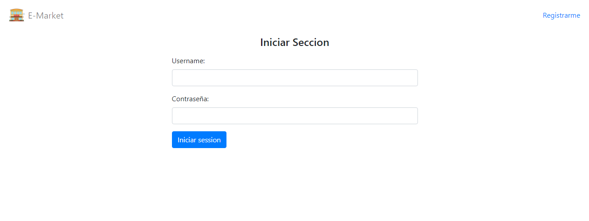
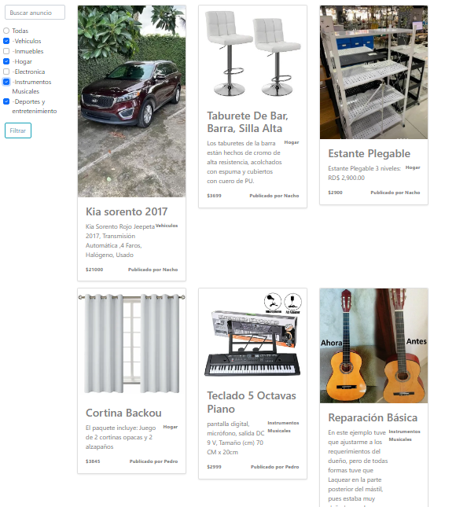
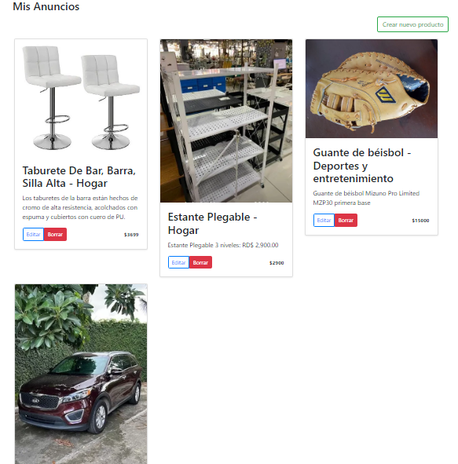
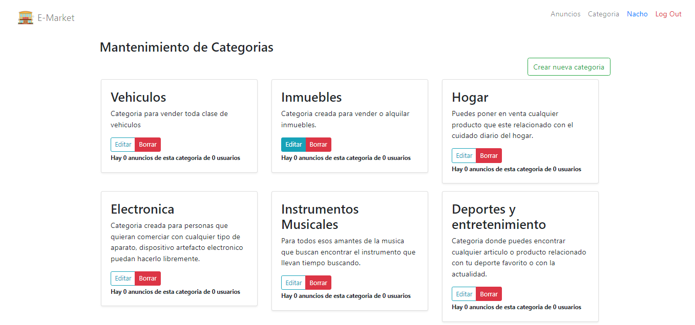

<div align="center">
  


    


</div>

# E-Market App

E-Market with login and registration of users, with maintenance of posts and categories, developed in MVC .Net 5 and for the data persistence SQL server.

- Onion Architecture
- Handling of Entity Framework Code First
- File uploading for publications
- Searches can be performed by product name
- Products can be filtered by product category

<hr></hr>
<h2>Technologies</h2>
<ul>
  <li>C# Asp.Net Core</li>
  <li>Entity Framework</li>
  <li>SQL Server</li>
  <li>Auto Mapper</li>
  <li>Bootstrap 5</li>
</ul>
<hr></hr>

## What do you need to run this project ?
* [Visual Studio](https://visualstudio.microsoft.com)

<h2>How to run</h2>

1. Clone this repo.
2. Open **E-Market.sln** in Visual Studio.
3. Set **E-Market** as startup project to run web app.
4. The database is remote.
But if you want to add to local database you need to open the file called "appsettings.json" and put the name of your server or computer where applicable, example:
    ```cmd
    Server=Your_Server;
    ```
    When you are in the nuget package console type the following command:
    ````cmd
    Update-database
5. **Start the project**.

<hr></hr>
  
 ## Project images
 - Login 
 
[](./Imgs/LoginPNG.PNG)
<br>
 - Home 
 
[](./Imgs/Home.PNG)
<br>
 - Maintenance of advertisements
 
[](./Imgs/Anuncios.PNG)

 
 - Maintenance of categories
[](./Imgs/CategoriasPNG.PNG)
 
<br><br>
## Developer
- Yeferson Rubio -> [Github](https://github.com/YefersonR) 


